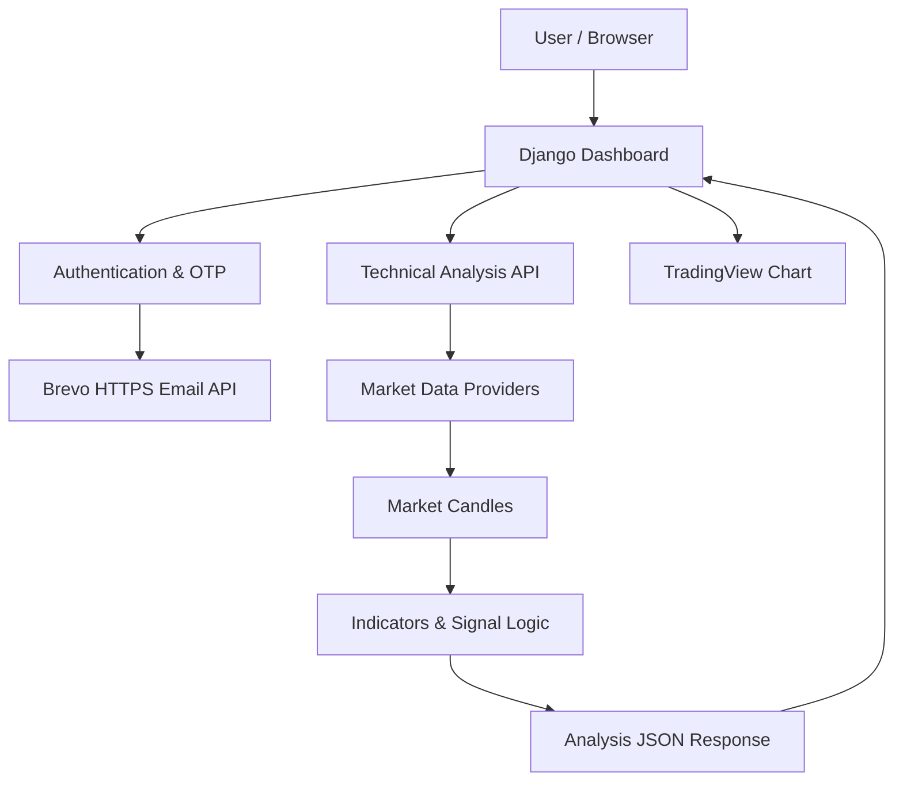
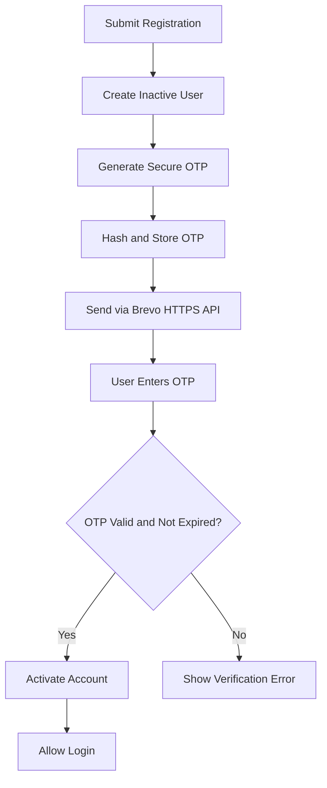

# Demo :- https://forex-bot-prediction.onrender.com/

# Forex Trading Dashboard

### A Django-powered market analytics platform with technical indicators, rule-based trading signals, and email-verified authentication.

<p align="center">
  <a href="https://forex-bot-prediction.onrender.com/">
    <strong>🚀 Live Demo</strong>
  </a>
  &nbsp; | &nbsp;
  <a href="https://github.com/pratik-parmar/Forex_Bot_Prediction">
    <strong>💻 GitHub Repository</strong>
  </a>
</p>

<p align="center">
  
  
  
  
  
  
</p>

---

## 📌 Project Overview

Forex Trading Dashboard is a full-stack web application built with Python and Django to monitor financial markets, analyze price movements, and generate rule-based trading signals.

The platform combines interactive TradingView charts with backend market-data processing and technical indicator calculations. It also implements user registration, session-based authentication, and email OTP verification using Brevo's HTTPS transactional email API.

The project demonstrates practical backend development, third-party API integration, authentication workflows, and deployment of a Django ASGI application.

**Live Application:** [Forex Trading Dashboard](https://forex-bot-prediction.onrender.com/)

---

## ✨ Key Features

### 📊 Market Visualization

- Interactive TradingView chart integration.
- Support for XAUUSD, EURUSD, GBPUSD, and BTCUSD in the backend analysis flow.
- Multiple chart timeframes, including 1m, 5m, 15m, 30m, 1H, and 1D.
- Responsive dashboard with dark and light theme support.

### 📈 Technical Analysis Engine

- Backend calculation of EMA 20 and EMA 50.
- RSI 14 and ATR 14 indicators.
- MACD and Bollinger Bands.
- Rule-based BUY, SELL, and HOLD signals.
- Signal reasoning and condition details.
- Entry, Stop Loss, and Take Profit calculations.

### 🔐 Authentication & Email Verification

- User registration and Django session-based login.
- Email OTP verification before account activation.
- Hashed OTP storage and expiration handling.
- Maximum verification attempts and resend cooldown.
- Brevo HTTPS API integration for transactional email delivery.

### ⚙️ Backend & API

- Django-based technical-analysis API.
- JSON responses for supported market symbols and timeframes.
- Integration with external market-data providers.
- ASGI application served through Daphne.
- Django Channels support for real-time communication features.

---

## 🛠️ Technology Stack

| Layer | Technologies |
|---|---|
| Backend | Python, Django |
| Frontend | HTML5, CSS3, JavaScript |
| Charting | TradingView Widget |
| Market Data | Finnhub API, Yahoo Finance where configured |
| Data Analysis | Pandas, Python |
| Authentication | Django Session Authentication |
| Email Service | Brevo Transactional Email API (HTTPS) |
| Real-Time Support | Django Channels, WebSockets |
| Database | SQLite |
| ASGI Server | Daphne |
| Static File Serving | WhiteNoise |
| Deployment | Render |

---

## 🏗️ Application Architecture

The application follows a modular Django architecture, separating dashboard views, market-data retrieval, and technical-analysis logic.



### Architecture Highlights

- **Separation of concerns:** Django views handle requests while market-data and strategy modules manage their respective responsibilities.
- **External API integration:** Market data and transactional email are retrieved through external services.
- **Authentication workflow:** Newly registered users must verify their email before they can log in.
- **JSON-based analysis:** The frontend can request market analysis without coupling the UI to the indicator implementation.

---

## 🔍 Technical Analysis API

The dashboard exposes a protected endpoint for retrieving technical-analysis results.

### Endpoint

```http
GET /api/technical-analysis/?symbol=XAUUSD&timeframe=15
```

### Supported Symbols

`XAUUSD` · `EURUSD` · `GBPUSD` · `BTCUSD`

### Supported Timeframes

| Parameter | Interval |
|---|---|
| `1` | 1 minute |
| `5` | 5 minutes |
| `15` | 15 minutes |
| `30` | 30 minutes |
| `60` | 1 hour |
| `D` | 1 day |

The API returns JSON containing the requested symbol, timeframe, and calculated analysis. Access is protected by the application's authentication decorator.

---

## 🔐 Email OTP Workflow

Email verification is implemented as part of the account registration process.



### Implementation Details

- OTPs are hashed before being stored.
- Verification codes expire after 10 minutes.
- Verification attempts are limited.
- OTP resend requests have a cooldown.
- Brevo's HTTPS API is used instead of SMTP, avoiding Render Free's outbound SMTP port restriction.
- Failed email delivery leaves the account inactive so the user can retry verification.

---

## 🚀 Run Locally

### Prerequisites

- Python 3.11+ (Python 3.13 recommended if supported by dependencies)
- Git
- Finnhub API key for configured market-data integrations
- Brevo API key and verified sender email for OTP delivery

### 1. Clone the Repository

```bash
git clone https://github.com/pratik-parmar/Forex_Bot_Prediction.git
cd Forex_Bot_Prediction
```

### 2. Create and Activate a Virtual Environment

**macOS / Linux**

```bash
python3 -m venv .venv
source .venv/bin/activate
```

**Windows**

```bash
python -m venv .venv
.venv\Scripts\activate
```

### 3. Install Dependencies

```bash
pip install -r requirements.txt
```

### 4. Configure Environment Variables

Create a `.env` file in the project root:

```env
DJANGO_SECRET_KEY=your_django_secret_key
DJANGO_DEBUG=True
DJANGO_ALLOWED_HOSTS=localhost,127.0.0.1
DJANGO_CSRF_TRUSTED_ORIGINS=

FINNHUB_API_KEY=your_finnhub_api_key

BREVO_API_KEY=your_brevo_api_key
BREVO_SENDER_EMAIL=your_verified_sender@example.com
BREVO_SENDER_NAME=Forex Terminal
```

Replace the placeholder values with your own credentials.

**Never commit `.env` or secret values to GitHub.**

The OTP email implementation uses Brevo's HTTPS API. SMTP credentials are not required for this email flow.

### 5. Apply Migrations

```bash
python manage.py migrate
```

### 6. Create a Superuser (Optional)

```bash
python manage.py createsuperuser
```

### 7. Start the Development Server

```bash
python manage.py runserver
```

Open [http://127.0.0.1:8000/](http://127.0.0.1:8000/).

For ASGI/WebSocket testing, run:

```bash
daphne -b 127.0.0.1 -p 8000 forex_web.asgi:application
```

---

## ☁️ Deployment

The application is deployed as a Django web service on Render.

| Setting | Configuration |
|---|---|
| Build Command | `pip install -r requirements.txt` |
| Start Command | `daphne -b 0.0.0.0 -p $PORT forex_web.asgi:application` |
| Environment | Render Environment Variables |
| Email Delivery | Brevo HTTPS API |

Production configuration includes Django secret key, allowed hosts, CSRF trusted origins, market-data API key, and Brevo API credentials.

> **Deployment note:** The current SQLite configuration is suitable for development and demonstration. A persistent database such as PostgreSQL is recommended for production user data because Render Free's local filesystem may not persist across redeployments.

---

## 🧠 Engineering Highlights

This project provided hands-on experience with:

- Building modular Django backend functionality.
- Integrating third-party APIs for market data and transactional email.
- Designing OTP verification with expiry, hashing, attempt limits, and resend cooldowns.
- Separating market-data retrieval from indicator and signal logic.
- Serving Django through an ASGI server.
- Configuring environment-based secrets and deployment settings.
- Troubleshooting production email delivery constraints on a free hosting platform.

---

## 🗺️ Future Improvements

- [ ] Migrate SQLite to PostgreSQL for persistent production data.
- [ ] Add automated unit and integration tests for authentication and analysis APIs.
- [ ] Improve market-data caching and API rate-limit handling.
- [ ] Expand strategy backtesting and performance evaluation.
- [ ] Add notifications for new trading signals.
- [ ] Explore secure MetaTrader 5 integration through a dedicated execution bridge.

---

## ⚠️ Disclaimer

This project is intended for educational, analytical, and informational purposes only. Trading signals are rule-based outputs and are not financial advice. They do not guarantee future market performance. No live trade execution is implied.

---

## 👨‍💻 Author

**Pratik Parmar**

- GitHub: [@pratik-parmar](https://github.com/pratik-parmar)
- Project: [Forex Trading Dashboard](https://github.com/pratik-parmar/Forex_Bot_Prediction)
- Live Demo: [forex-bot-prediction.onrender.com](https://forex-bot-prediction.onrender.com/)
